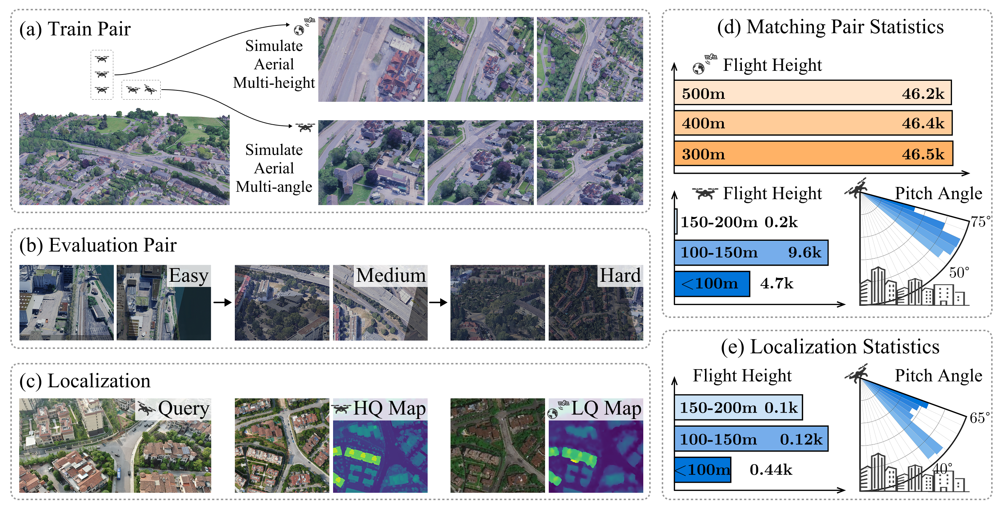

# AerialExtreMatch: A Benchmark for Extreme-View Image Matching and Localization
### [Project Page](https://xecades.github.io/AerialExtreMatch/) | Paper (WIP)

 

> **AerialExtreMatch: A Benchmark for Extreme-View Image Matching and Localization**  
> [Rouwan Wu1](https://github.com/RingoWRW), [Zhe Huang2](https://github.com/Xecades), [Xingyi He2](https://hxy-123.github.io/), [Yan Liu3](https://faculty.hdu.edu.cn/jsjxy/ly2_21682/main.htm), [Shen Yan1](https://openreview.net/profile?id=~Shen_Yan6), [Sida Peng2](https://pengsida.net/), [Maojun Zhang1&dagger;](https://orcid.org/0000-0001-6748-0545), [Xiaowei Zhou2&dagger;](https://xzhou.me/)  
> National University of Defense Technology1, State Key Lab of CAD&CG, Zhejiang University2, Huazhong University of Science and Technology3  
> <!-- NeurIPS --> 2025

    
     
    <em>We introduce <b>AerialExtreMatch</b>, a large-scale, high-fidelity benchmark tailored for extreme-view image matching and UAV localization. It consists of three datasets: <b>Train Pair</b>, <b>Evaluation Pair</b>, and <b>Localization</b>. All code and datasets are readily available for public access.</em>

> [!WARNING]  
> Docs are under preparation, and will be released soon.

## Resources

> [!IMPORTANT]  
> In our paper, TWO seperate codebases are provided: **benchmarking** and code of our pretrained **RoMa** model.  
> To increase simplicity and consistency, we slightly abuse the concept of git branches and **make the two codebases as branches of this repository**.

 - **Code**
   - [**`Benchmark` branch**](https://github.com/Xecades/AerialExtreMatch/tree/Benchmark): source code for the benchmark, including feature matching and localization pipelines for models mentioned in the paper. **(WIP)**
   - [**`RoMa` branch**](https://github.com/Xecades/AerialExtreMatch/tree/RoMa): the code we use to train our RoMa model.
 - **Dataset**
   - [**AerialExtreMatch-Train**](https://huggingface.co/datasets/Xecades/AerialExtreMatch-Train): corresponds to **Train Pair** set.
   - [**AerialExtreMatch-Benchmark**](https://huggingface.co/datasets/Xecades/AerialExtreMatch-Benchmark): corresponds to **Evaluation Pair** set.
   - [**AerialExtreMatch-Localization**](https://huggingface.co/datasets/Xecades/AerialExtreMatch-Localization): corresponds to **Localization** set.
 - **Checkpoints**: see [[Release]](releases).

## Introduction

WIP.

## License

[MIT License](LICENSE)
