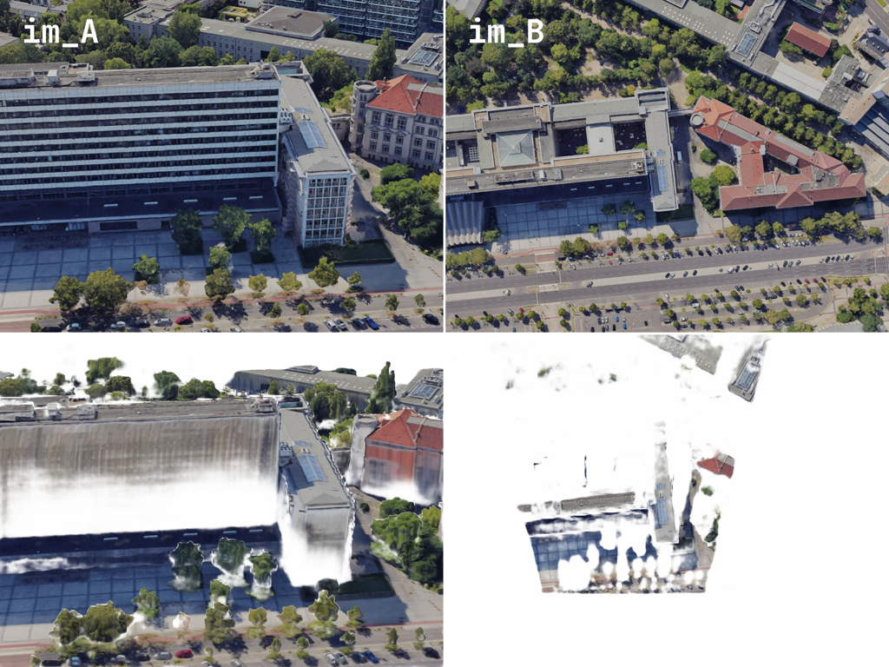

# AerialExtreMatch — RoMa

<p align="center">
    
    <br>
    <em>Matches masked by certainty.</em>
</p>

## Introduction

This branch contains the code for training from scratch and finetuning the [RoMa](https://arxiv.org/abs/2305.15404) model on our proposed **AerialExtreMatch** dataset. The code is built on top of the [RoMa repo](https://github.com/Parskatt/RoMa). It is recommended to check out the original repo for more details on the model and its usage.

## Checkpoints

We provide our finetuned weights for the AerialExtreMatch dataset at [[Release]](https://github.com/Xecades/AerialExtreMatch/releases).

## Setup / Settings / Usage

Follow the instructions on [RoMa](https://github.com/Parskatt/RoMa).

## Demo

Two matching demos are provided in the [demos folder](demo). They are adapted from the official RoMa demos, see [RoMa](https://github.com/Parskatt/RoMa?tab=readme-ov-file#demo--how-to-use) for more details.

## Training

The training scripts are implemented in the [experiments folder](experiments).

1. Follow the instructions on [DKM](https://github.com/Parskatt/DKM/blob/main/docs/training.md#megadepth) for downloading and preprocessing the MegaDepth dataset.
2. Download the [AerialExtreMatch-Train](https://huggingface.co/datasets/Xecades/AerialExtreMatch-Train) dataset and unzip it into the `data/extre` folder.  
   By now you should have the following folder structure in `data`:
    ```
    data
    ├── extre
    │   ├── scene_info
    │   └── Basaier0, ...
    └── megadepth
        ├── phoenix
        │   └── S6
        │       └── zl548
        │           └── MegaDepth_v1
        ├── prep_scene_info
        └── Undistorted_SfM
    ```
3. Run the relevant experiment. e.g.
    ```bash
    # Finetuning from official pretrained RoMa weights
    torchrun --nproc_per_node=8 --nnodes=1 --rdzv_backend=c10d experiments/train_roma.py --gpu_batch_size 3 --use_pretrained_roma

    # Training from scratch
    torchrun --nproc_per_node=8 --nnodes=1 --rdzv_backend=c10d experiments/train_roma.py --gpu_batch_size 3
    ```

## License

[MIT License](LICENSE).

## Acknowledgement

This codebase builds on the code in [RoMa](https://github.com/Parskatt/RoMa).
